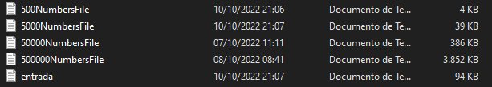
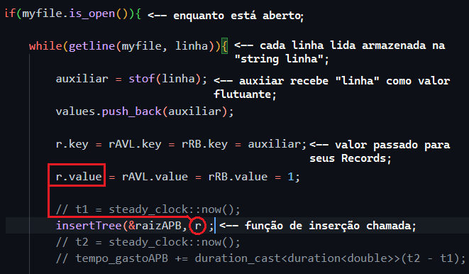
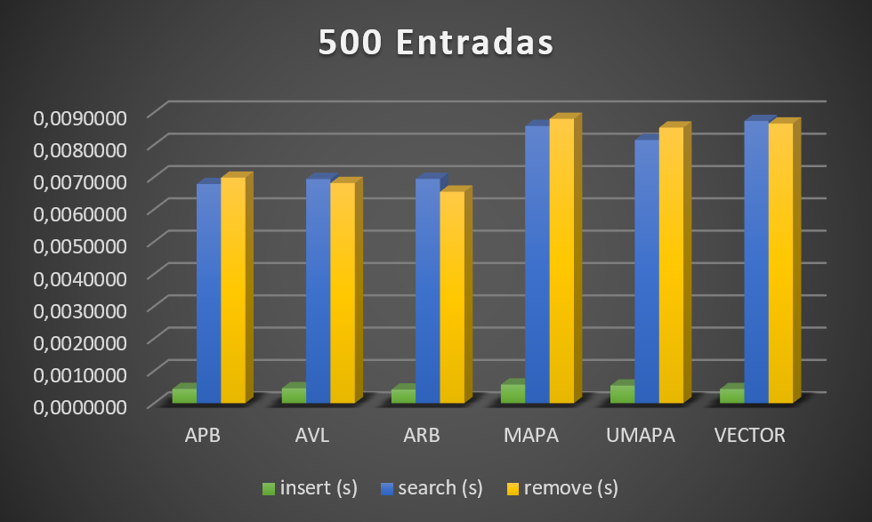
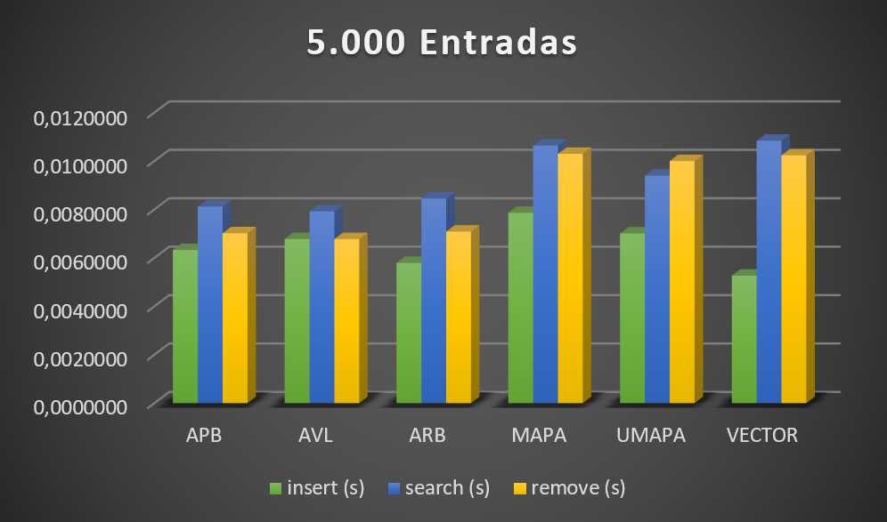
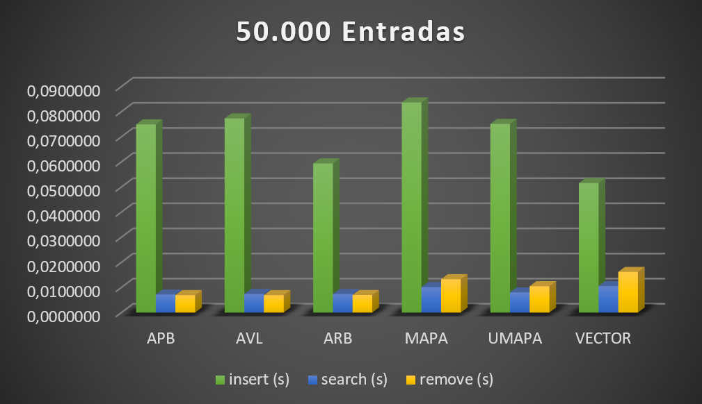

# Tree Structure Comparison 🌲

 
 
 

# OBJETIVOS

Foi proposto pelo professor Michel Pires na disciplina de Algorítmo e Estrutura de Dados II, um trabalho no qual o objetivo era comparar todas as estruturas de <i>Árvores</i> apresentadas até a data de hoje, além disso, também deveriam entrar na comparação outros tipos de estruturas como: <i>Map</i>, <i>Unordered Map</i> e <i>Vector</i>.

Sendo assim, após a conclusão do projeto, temos aqui um algorítmo capaz de: 
<b>- [✔️] Ler números decimais de um arquivo externo; </b>
<b>- [✔️] Utilizar o <i>QuickSort</i> para ordenar o vector durante a inserção; </b>
<b>- [✔️] Comparar os tempos gastos a cada etapa do programa; </b>
<b>- [✔️] Funções como inserir, pesquisar, remover e ordenar (quando necessário) funcionando em todas as estruturas;  </b>

Após a apresentação do tema, bem como a demonstração da lógica, serão apresentados todos os resultados obtidos a partir dos testes feitos.

# INTRODUÇÃO

<b>O que é uma árvore em programação?</b> Árvore é uma estrutura de dados que organiza seus elementos de forma hierárquica, onde existe um elemento que fica no topo da árvore, chamado de raiz e existem os elementos subordinados a ele, que são chamados de nós filhos. Cada nós filho pode conter zero, um ou mais de um nós filhos. Os nós filhos que não contém outros nós filhos são chamados de nós folha.

<b>Características de uma Árvore</b>
<ul>
<li>Raiz: Toda arvore possui o nó raiz que é o nó inicial da árvore;</li>
<li>Grau: o número de filhos que um nó possui;</li>
<li>Nível (ou profundidade): a distância de um nó até a raiz;</li>
<li>Altura: o maior nível encontrado na árvore (altura de uma árvore com n nós pode variar de lg(n) até n-1;</li>
<li>Folha: o nó que não possui filho.</li>
</ul>

A partir dessas características, foram a nos apresentadas três diferentes estruturas em Árvore: <i>Árvore de Pesquisa Binária</i>, <i>Árvore AVL</i> e <i>Árvore Red/Black</i>. Cada uma delas com suas características e peculiaridades, o que possibilita realizar a comparação entre elas e concluir com êxito o objetivo do trabalho.

<b>* IMPORTANTE * </b> É válido salientar que NENHUMA das estruturas de árvores aqui implementadas foram feitas pelo autor, com excessão da remoção na árvore red/black, que foi tirada do livro <i>Matemática Discreta e Suas Aplicações 6ª ed.</i> do autor Kenneth H. Rossen, todas as outras funções e lógicas foram arquitetadas pelo professor, apenas pequenas modificações foram feitas para o funcionamento ideal do progama. Caso deseje ler as funções originais, é possível acessá-las clicando <a href="https://github.com/mpiress"> aqui</a>.

# LÓGICA UTILIZADA

<h2>⚙️ Estruturas: </h2>

Como já citado anteriormente, o objetivo principal do trabalho não era implementar as estrutras e sim realizar testes visando compara-las. Por conta disso, não extenderemos muito sobre as funções principais de cada árvore, uma vez que não foram feitas pelo autor.

Uma das poucas alterações que se mostraram necessárias durante a codificação, foi a necessidade de adotar a mesma estrutura mostrada no livro para a criação das árvores para que a remoção na red/black fosse concluida. No código disponibilizado para uso, durante a criação da árvore, era atribuido <i>NULL</i> ou <i>nullptr</i> (C++) para certificar de que seria criado apenas a raiz. Já no livro, usa-se a palavra <i>nill</i> que diz respeito aos filhos do nó receberem ponteiros nulos. No começo pareceu confuso, mas após ler o passo a passo mostrado no livro, torna-se fácil entender esse ponto. Por isso, a função padrão <code>CreateTree()</code>, para a red/black, foi substituida por uma <code>initializeTreeRB()</code> na qual iguala a nulo todos os possíveis elementos envoltos à raiz.

 

ㅤ ㅤㅤㅤㅤㅤㅤㅤㅤㅤㅤ
<i>Figura 1: Função <code>initializeTreeRB()</code> modificada.</i>

 

No programa, não há nenhum tipo de menu, sendo assim, todas as estruturas irão rodar com todos os arquivos automaticamente. Caso o usuário deseje operar com apenas um dos arquivos, no <code>main()</code>, deve comentar adicionando " // " antes das linhas referentes aos arquivos que ele não deseja executar.

Todas as operações acontecem dentro de uma mesma função, a <code>leArquivos( TAM )</code>. Essa é a única função chamada no main do programa e, a cada chamada passa um tamanho TAM diferente, onde cada TAM representa um arquivo. Os arquivos dos quais o programa irá retirar os valores tem uma formatação padrão enquanto ao seus nomes. Para o ideal funcionamento do algoritmo, os arquivos devem ter como nome a seguinte estrutura: <code>(TAM)NumbersFile.txt</code> como mostra a figura 2. 

ㅤ ㅤㅤㅤㅤㅤㅤㅤ
<i>Figura 2: Estrutura padrão para os nomes dos arquivos.</i>

 

Caso o usuário deseje adicionar um novo arquivo para testes, deve serguir esse formato, além de garantir que todos os valores presentes dentro do arquivo sejam "flutuantes" com até 6 casas decimais.

Na figura 2 é possível perceber que tem um arquivo que foge dos padrões e recebe o nome de <code>entrada.txt</code>. Esse arquivo é onde estão armazenados os valores aos quais, após a inserção, serão pesquisados dentro das estruturas. Com isso, caso o usuário deseje altera-los, basta inserir um novo arquivo de entrada para pesquisa, mas mantendo o nome <code>entrada.txt</code> para que não seja necessário mudar nada nas funções de leitura.

A leitura dos arquivos acontece de forma padrão, a qual já foi citada várias vezes em fórums e outros READMEs. Utilizando a bilbioteca <code>< fstream ></code> e sua função <code>is_open()</code> seguida de um <code>while</code> que roda até que o arquivo chegue ao fim, cada linha lida é capturada com o <code>getline()</code>, armazenada em uma <code>string LINHA</code> que com o auxílio da função <code>stof()</code> é converitda para valor "flutuante" e associada a variável <code>float AUX</code>. Por fim, esse valor agora float, é inserido nas estruturas.

  ㅤㅤㅤㅤㅤㅤㅤㅤ
<i>Figura 3: Exemplo de como a inserção é feita/chamada.</i>

Exatamente este mesmo passo a passo é usado para todas as demais estruturas de dados, com excessão do Vector que, como pedido pelo professor, a pesquisa deveria ser feita a partir do método de pesquisa binária. Por isso, um tempo a mais é necessário para que ele seja ordenado, uma vez que apenas é possível realizar busca binária em estruturas ordenadas. Para tal, foi implementado um <i>QuickSort</i> que mostrou desempenho incível durante a ordenação, mas isso será discutido daqui a pouco.

Na verdade, essa estrutura mostrada na figura 3 é usada para todos os metodos em todas as estruturas de dados, com alteração, é claro da função chamada (insert, serach e remove), sendo assim, qualquer possível manutenção no código ou alteração por parte do usuário seria de extrema tranquilidade, uma vez que, tudo segue exatamente o mesmo padrão.

<h2>🕗 Tempo: </h2>

Para coletar o tempo gasto para cada interação nas diferentes estruturas, utilizou-se a biblioteca <code>< chrono ></code>, bem como o <code>namespasce chrono</code>. Inicialmente, tentou-se utilziar a biblioteca <code>< time.h ></code>, porém, a mesma mostrou desempenho duvidoso enquanto rodando no Windows 10 em um WSL de Ubuntu. Por conta disso, seus resultados não compatíveis trouxeram a necessiade de uma nova bilbioteca que tivesse haver com tempo de execução. A Chrono, por sua vez, mostrou-se eficiente mesmo no Win10, exibindo resultados compatíveis e bastante precisos. Sua implementação não é tão simples quanto a da outro bilbioteca, porém não é nada muito complexo também!

ㅤㅤㅤㅤㅤㅤㅤ

<i>Figura 4: Inicialização/declaração necessárias da bib. Chrono.</i>

Perceba que é atribuido como valor para cada variável a função <code>(t1 - t1)</code>, que nada mais serve para zera-las, evitando lixo de memória e tempos sobrepostos. Provavelmente exista algum método próprio para isso, ou um jeito mais inteligente de se fazer. Este está funcionando, e foi o pensado na hora, por tanto, está ótimo!.

# RESULTADOS E ANÁLISE

Após terminar todo o projeto, realizou-se diversos testes (mais especificadamente 3 testes para cada tamanho de arquivo), e tirou-se a média de tempo que cada estrutura gastou para realizar determinada ação. É importante lembrar que para a função <code>Search</code>, utilizou-se como padrão o arquivo "entrada.txt", o qual carregava consigo 10.000 valores flutuantes que seriam pesquisados em cada estrutura. Desses dez mil arquivos, alguns deles (60%) propositalmente foram inseridos sabendo que os mesmos <b>NÃO</b> existem em nenhuma das entradas, enquanto os outros 40%, são valores que existem nos arquivos, por tanto, estarão dentro das estruturas, se tudo tiver ocorrido be. Os resultados obtidos estão na grandeza dos segundos, e podem ser visualizados abaixo.

| Entrada: 500           |  Insert                            |  Search      | Remove     |
| -----------------------| -----------------------------------|--------------|------------|
|  <i>"APB"</i>           | 0,0004302  s                      |0,0425016 s   |0,0069817 s |
|  <i>"AVL"</i>           | 0,0004856  s                      |0,419173  s   |0,0071158 s |
|  <i>"ARB"</i>           | 0,0004316  s                      |0,0067887 s   |0,0065474 s |
|  <i>"MAP"</i>           | 0,0006265  s                      |0,0086286 s   |0,0088016 s |
|  <i>"U_MAP"</i>         | 0,0006222  s                      |0,0085109 s   |0,0085326 s |
|  <i>"VECTOR"</i>        | 0,0004315  s                      |0,0085571 s   |0,0086568 s |

| Entrada: 5000          |  Insert                            |  Search      | Remove     |
| -----------------------| -----------------------------------|--------------|------------|
|  <i>"APB"</i>          | 0,0046470  s                       |0,931 s       |0,0076979 s |
|  <i>"AVL"</i>          | 0,0052898  s                       |0,705084  s   |0,0074918 s |
|  <i>"ARB"</i>          | 0,0044727  s                       |0,0077954 s   |0,0065756 s |
|  <i>"MAP"</i>          | 0,0060923  s                       |0,0098897 s   |0,0095404 s |
|  <i>"U_MAP"</i>        | 0,0053704  s                       |0,0087963 s   |0,0087494 s |
|  <i>"VECTOR"</i>       | 0,0045561  s                       |0,0099702 s   |0,0096092 s |

| Entrada: 50000         |  Insert                            |  Search      | Remove     |
| -----------------------| -----------------------------------|--------------|------------|
|  <i>"APB"</i>          | 0,0577741  s                       |14,6421 s     |0,0114723 s |
|  <i>"AVL"</i>          | 0,062219   s                       |10,2599  s    |0,0099976 s |
|  <i>"ARB"</i>          | 0,0498004  s                       |0,0110686 s   |0,0073805 s |
|  <i>"MAP"</i>          | 0,0679396  s                       |0,0143497 s   |0,0139011 s |
|  <i>"U_MAP"</i>        | 0,0615733  s                       |0,0120599 s   |0,0114058 s |
|  <i>"VECTOR"</i>       | 0,0475686  s                       |0,0154414 s   |0,0180312 s |

| Entrada: 500000        |  Insert                            |  Search      | Remove     |
| -----------------------| -----------------------------------|--------------|------------|
|  <i>"APB"</i>          | 0,797044  s                        |210,743 s     |0,0119273 s |
|  <i>"AVL"</i>          | 0,783368  s                        |180,515  s    |0,0097882 s |
|  <i>"ARB"</i>          | 0,606567  s                        |0,0193723 s   |0,0067638 s |
|  <i>"MAP"</i>          | 0,829979  s                        |0,0258988 s   |0,0134668 s |
|  <i>"U_MAP"</i>        | 0,69385   s                        |0,0207344 s   |0,0106011 s |
|  <i>"VECTOR"</i>       | 0,536605  s                        |0,024973 s    |0,0937327 s |

| Legenda                |  Significado                                                                                      |                     
| -----------------------| ------------------------------------------------------------------------------------------------- |
|  "APB"                 |Árvore de Busca Binária                                                                            |
|  "AVL"                 | Árvore AVL (Adelson Velsky e Landis)                                                              |               
|  "ARB"                 | Árvore Red/Black                                                                                  |
|  "MAP"                 | Mapa (C++)                                                                                        |
|  "U_MAP"               | Mapa Desordenado (C++)                                                                            |
|  "VECTOR"              | Vector (C++)                                                                                      |

Ao analisar os resultados, fica claro a discrepância quanto a eficiência da árvore Red/Black com as demais árvores. Quanto mais o tamanho dos arquivos aumentam para cada função (insert, search, remove), mais as árvores Binária de Busca e AVL se mostram menos eficientes. Os gráficos a seguir plotam exatamente essa relação [Tempo <b>x</b> Tamanho].

ㅤ ㅤㅤㅤㅤㅤㅤㅤ
<i>Figura 5: Gráfico relacionando o tempo de execução <b>(em segundos)</b> com o tamanho do arquivo, para cada estrutura.</i>

ㅤ ㅤㅤㅤㅤㅤㅤㅤ
<i>Figura 6: Gráfico relacionando o tempo de execução <b>(em segundos)</b> com o tamanho do arquivo, para cada estrutura.</i>

ㅤ ㅤㅤㅤㅤㅤㅤㅤ
<i>Figura 7: Gráfico relacionando o tempo de execução <b>(em segundos)</b> com o tamanho do arquivo, para cada estrutura.</i>

ㅤ ㅤㅤㅤㅤㅤㅤㅤ
<i>Figura 8: Gráfico relacionando o tempo de execução <b>(em segundos)</b> com o tamanho do arquivo, para cada estrutura.</i>

É importante lembrar que, o eixo <i>Y</i> está na grandeza de segundos, por tanto, para converter em minutos, deve se dividir o valor por 60. Analisando os gráficos, chega a ser engraçada a tamanha ineficiência das duas árvores APB e AVL, uma vez que os valores computados pelas outras estruturas são tão inferiores, que chegam a ser insignificantes ao se observar.

<h2>📈 Conclusões: </h2>

Como citado no começo do texto, uma coisa que chama a atenção ao analisar os dados, é a excelente eficiência da ordenação <i>QuickSort</i>, que permitiu com que o vector, mesmo sendo "defasado" por precisar ser ordenado, conseguisse concluir a carga de testes com um tempo muito satisfatório. Entretanto, vale dizer que esse tempo absurdamente baixo não se dá pela estrutura do Vector, e sim pela eficiência do algorítmo Sort. Antes de implementar o QuickSort, utilizou-se a função <code>sort()</code> (C++), que usa um InsertionSort. Com ela, a inserção/ordenação de 50.000 entradas levava em torno de 20 - 23 minutos, valor este que se reduziu a uma fração de segundos com o quick. Para a entrada de 500.000 então... o insertion sort apresentou comportamento deplorável, demorando 7 horas (sim, HORAS!), para ordenar todos os valores durante a inserção. Com isso, pode-se concluir sobre o vector que: Para valores de entrada grandes, é essencial o usso de um bom algorítmo de ordenação, caso não seja possível, exclua essa estrutura da sua lista de opções, será horrível.

Sobre os dois tipos de Mapas disponibilizados pelo C++, é possível dizer que sim, eles apresentam ganhos em relação a tempo de execução, porém, apenas quando comparados ás árvores APB e AVL. Apesar de ambos apresentarem desempenho muito satisfatório também, em todos os testes eles ficaram atrás da Red/Black, além de serem mais rápidos e eficientes que o vector utilizando o QuickSort (O que ja é muito interessante). Devido a simplicidade que é utilizar essas estruturas, e o tempo extremamente satisfatório, conclui-se que sim, são boas opções para operar com grandes volumes de entradas. O mapa desordenado pricipalmente, por garantir sempre um tempo razoavelmente melhor que seu "irmão" ordenado.

A rainha das estruturas nesses testes que foram realizados, com certeza foi a Árvore Red/Black. Apresentando desempenho muito superior ao esperado (uma vez que possui umas das implementações mais complicadas das estruturas analisadas, principalmente para remover valores), ela chegou como forte candidata ao título de melhor estrutura de dados para as funções analisadas, porém, sua difícil implementação com certeza a faz perder pontos neste ranking, uma vez que, o Mapa Desordenado por exemplo possui desempenho bem parecido com a Red/Black, apesar de nunca superá-la, a facilidade que ele proporciona ao programador com certeza deve ser levada em consideração.

Em síntese, conclui-se que cada estrutura tem vantagens e desvantagens, como já era de se esperar. Analisando todos os valores obtidos pelas estruturas e as horas gastas se dedicando a cada uma delas, o resultado não podia ser diferente.

<ul>
<li>🥇 <b>Mapas do C++</b>. Ótimo desempenho aliado a uma simples implementação; </li>
<li>🥈<b>Árvore Red/Black</b>. Ótimo desempenho, porém difícil implementação;</li>
<li>🥉<b>Vector (??)</b>. Bom desempenho, porém é 100% dependente de uma boa ordenação;</li>
<li>🎖️<b>Árvore AVL</b>. Desempenho bom para pequenas entradas, porém insatisfatório para entradas/pesquisas relativamente grandes.</li>
<li>😒<b>Árvore de Pesquisa Binária</b>. Desempenho relativamente bom apenas para entradas/pesquisas pequenas, muito ruim para leituras grandes.</li>
</ul>

Por fim, todas as estruturas foram capazes de finalizar e objetivar o trabalho. Apesar disso, não foram todas que apresentaram bom desempenho ao final. A escolha de determinada estrutura de dados não depende apenas do quanto ela se mostra eficiente. Cada tipo de problema pode exigir e se mostrar mais simples a partir de certa estrutura. Conclui-se então que, para os testes feitos, os mapas do C++ tiveram melhor custo/benefício de todas as estruturas, obtendo tempos excelentes e uma implementação super simples e intuitiva.

# COMPILAÇÃO E EXECUÇÃO

A algorítmo disponibilizado possui um arquivo Makefile que realiza todo o procedimento de compilação e execução. Para tanto, temos as seguintes diretrizes de execução:

| Comando                |  Função                                                                                           |                     
| -----------------------| ------------------------------------------------------------------------------------------------- |
|  `make clean`          | Apaga a última compilação realizada contida na pasta build                                        |
|  `make r`                | Executa a compilação do programa utilizando o gcc, e o resultado vai para a pasta build, além de em seguida executar o programa da pasta build após a realização da compilação             |

# BIBLIOTECAS 
Para o funcionamento desejado, é necessário incluir as seguintes bibliotecas no programa: 

<ul>
	<li><code>#include 'iostream'  </code></li>
	<li><code>#include 'map'</code></li>
	<li><code>#include 'unordered_map'</code></li>
	<li><code>#include 'bits/stdc++.h'</code></li>
	<li><code>#include 'string'</code></li>
	<li><code>#include 'ctime'</code></li>
	<li><code>#include 'ratio'</code></li>
	<li><code>#include 'fstream'</code></li>
	<li><code>#include 'vector'</code></li>
	<li><code>#include 'algorithm'</code></li>
    <li><code>#include 'chorno'</code></li>
    <li><code>#include 'stdlib.h'</code></li>
    <li><code>#include 'stdbool.h'</code></li>
</ul>

# AUTOR
Criado por Henrique Souza Fagundes;

Aluno do 4° periodo do curso de `Engenharia da Computação` no [CEFET-MG](https://www.cefetmg.br)